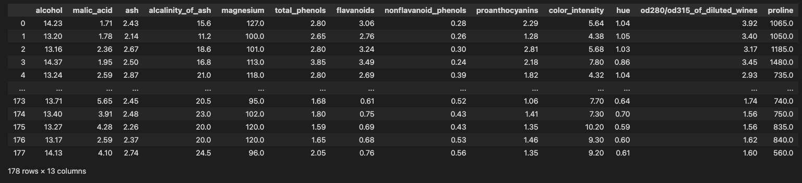
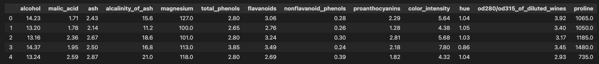
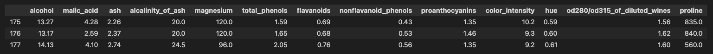
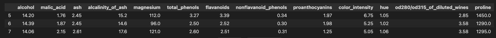
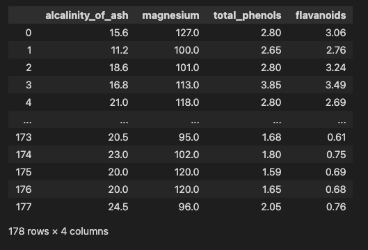
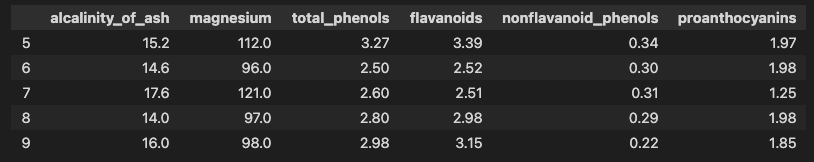
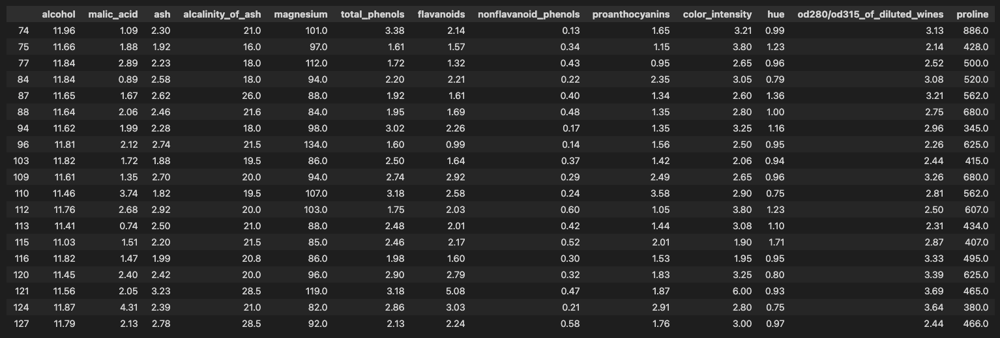
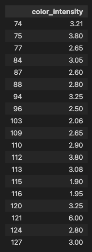
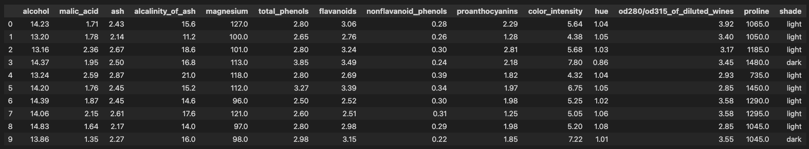

# Accessing Data within Pandas

## Introduction
In this lesson, we're going to dig into various methods for accessing data from our Pandas Series and DataFrames.

## Objectives

You will be able to:

- Use pandas methods and attributes to access information about a dataset   
- Index pandas dataframes with .loc, .iloc, and column names   
- Use a boolean mask to index pandas series and dataframes 


## Importing pandas and the data

First, let's make sure we import `pandas` as `pd`.

> In the cell below, type the code to import the pandas library with the standard alias.

<details>
    <summary>
        <b><u>Reveal Code</u></b>
    </summary>
    <pre><code language="python">import pandas as pd
    </code></pre>
</details>


```python
# replace this comment with the code to import the pandas library and set the standard alias
```

To show how to access data with Pandas, let's use the `wine` dataset in the scikit-learn library. Don't worry about the code below. We're essentially just making sure you have access to the `wine` dataset.

The data contained in the wine dataset are the results of a chemical analysis of wines grown in Italy. It contains the quantities of 13 wine constituents. 

> To load the dataset, import the `load_wine` function from the `sklearn.datasets` library by typing in the following code:

`from sklearn.datasets import load_wine`

> Then we we will load the dataset by calling the function and assigning it to the variable `data` by typing the following code:

`data = load_wine()`

> Finally, we will create a DataFrame from `data` by typing in the following code:

`df = pd.DataFrame(data.data, columns=data.feature_names)`


```python
# replace this comment with the code to import pandas and set the alias

# replace this comment with the code to load the data and assign it to the variable

# replace this comment with the code to create a DataFrame from the data

```

Great! Our data set is now stored in the variable `df`. As you know, you can look at its elements by using `df` or `print(df)`.

> In the cell below, print the DataFrame `df` to check that our code worked.

<details>
    <summary>
        <b><u>Reveal Code</u></b>
    </summary>
    <pre><code language="python">print(df)
    </code></pre>
</details>


```python
# replace this comment with the code to print out the DataFrame we just created
```

---
#### Expected Output
<pre><code>a pandas DataFrame with 178 rows and 13 columns and the following column names:
alcohol  malic_acid   ash  alcalinity_of_ash  magnesium  total_phenols 
</code></pre>
<details>
    <summary>
        <b><u>Click to Expand Complete Output</u></b>
    </summary>

</details>

---


Now, what if you want to see only a few lines of the data, based on certain constraints? You'll learn how to access data in this lesson!

## Methods and attributes to access data information

It won't be a surprise that our `df` object is a Pandas DataFrame object. Let's verify this using the `type()` function: 
> In the cell below, use the `type()` function to check the data type of `df`:

<details>
    <summary>
        <b><u>Reveal Code</u></b>
    </summary>
    <pre><code language="python">type(df)
    </code></pre>
</details>


```python
# replace this comment with the code to check the data type of `df`
```

---
#### Expected Output
<pre><code>pandas.core.frame.DataFrame
</code></pre>
---

There are some methods and attributes associated with Pandas objects (both DataFrames *and* series!) which make retrieving information from the data particularly easy. Some commonly used methods:
- `.head()`
- `.tail()`

And attributes:
- `.index`
- `.columns`
- `.dtypes`
- `.shape`

### Some methods: `.head()`, `.tail()`, and `.info()`

By using `.head()` and `.tail()`, you can select the first or last $n$ rows from your dataframe. The default $n$ is 5, but you can change this value inside the parentheses. For example:

> In the cell below, type the code to show the first 5 rows of `df` using the `head()` method:

<details>
    <summary>
        <b><u>Reveal Code</u></b>
    </summary>
    <pre><code language="python">df.head()
    </code></pre>
</details>


```python
# replace this comment with the code to display the first 5 rows of df
```

---
#### Expected Output
<pre><code>the first 5 lines of the DataFrame df with indices 0-4
</code></pre>
<details>
    <summary>
        <b><u>Click to Expand Complete Output</u></b>
    </summary>

</details>

---

> In the cell below, type the code to display the last three rows of `df` using the `.tail()` method adding the value `3` to override the default value of the _n-rows_ parameter:
<details>
    <summary>
        <b><u>Reveal Code</u></b>
    </summary>
    <pre><code language="python">df.tail(3)
    </code></pre>
</details>


```python
# replace this comment with the code to display the last 3 rows of df
```

---
#### Expected Output
<pre><code>the last 3 lines of the DataFrame df with indices 175-177
</code></pre>
<details>
    <summary>
        <b><u>Click to Expand Complete Output</u></b>
    </summary>

</details>

---


To get a concise summary of the dataframe, you can use `.info()`: 

> In the cell below, type the code to display a summary of `df` by using the `.info()` method:

<details>
    <summary>
        <b><u>Reveal Code</u></b>
    </summary>
    <pre><code language="python">df.info()
    </code></pre>
</details>


```python
# replace this comment with the code to display a summary of df
```

---
#### Expected Output
<pre><code>a summary of the DataFrame df
</code></pre>
<details>
    <summary>
        <b><u>Click to Expand Complete Output</u></b>
    </summary>
    <pre><code language="python">&lt;class 'pandas.core.frame.DataFrame'&gt;
RangeIndex: 178 entries, 0 to 177
Data columns (total 13 columns):
 #   Column                        Non-Null Count  Dtype  
---  ------                        --------------  -----  
 0   alcohol                       178 non-null    float64
 1   malic_acid                    178 non-null    float64
 2   ash                           178 non-null    float64
 3   alcalinity_of_ash             178 non-null    float64
 4   magnesium                     178 non-null    float64
 5   total_phenols                 178 non-null    float64
 6   flavanoids                    178 non-null    float64
 7   nonflavanoid_phenols          178 non-null    float64
 8   proanthocyanins               178 non-null    float64
 9   color_intensity               178 non-null    float64
 10  hue                           178 non-null    float64
 11  od280/od315_of_diluted_wines  178 non-null    float64
 12  proline                       178 non-null    float64
dtypes: float64(13)
memory usage: 18.2 KB
    </code></pre>
</details>

---

### Some attributes

Using `.index`, you can access the index or row labels of the DataFrame.

> In the cell below, type the code to display the information about the index using the `.index` attribute:

<details>
    <summary>
        <b><u>Reveal Code</u></b>
    </summary>
    <pre><code language="python">df.index
    </code></pre>
</details>


```python
# replace this comment with the code to display information about the index of df
```


---
#### Expected Output
<pre><code>RangeIndex(start=0, stop=178, step=1)
</code></pre>
---

Using `.columns`, you can access the column labels of the DataFrame.

> In the cell below, type the code to display the column information of `df` using the `.columns` attribute:

<details>
    <summary>
        <b><u>Reveal Code</u></b>
    </summary>
    <pre><code language="python">df.columns
    </code></pre>
</details>


```python
# replace this comment with the code to display information about the columns of df  
```

---
#### Expected Output
<pre><code>Index(['alcohol', 'malic_acid', 'ash', 'alcalinity_of_ash', 'magnesium',
       'total_phenols', 'flavanoids', 'nonflavanoid_phenols',
       'proanthocyanins', 'color_intensity', 'hue',
       'od280/od315_of_diluted_wines', 'proline'],
      dtype='object')
</code></pre>
---

Using `.dtypes` returns the data types of all columns in the DataFrame (compare with `.info()`!)

> In the cell below, type the code to display the data types of each column in `df` using the `.types` attribute:

<details>
    <summary>
        <b><u>Reveal Code</u></b>
    </summary>
    <pre><code language="python">df.types
    </code></pre>
</details>


```python
# replace this comment with the code to display the data types in df
```

---
#### Expected Output
<pre><code>alcohol                         float64
malic_acid                      float64
ash                             float64
alcalinity_of_ash               float64
magnesium                       float64
total_phenols                   float64
flavanoids                      float64
nonflavanoid_phenols            float64
proanthocyanins                 float64
color_intensity                 float64
hue                             float64
od280/od315_of_diluted_wines    float64
proline                         float64
dtype: object
</code></pre>
---

`.shape` returns a tuple representing the dimensionality  (in `(rows, columns)` ) of the DataFrame.

> In the cell below, type the code to display the shape of `df` using the `.shape` attribute:

<details>
    <summary>
        <b><u>Reveal Code</u></b>
    </summary>
    <pre><code language="python">df.shape
    </code></pre>
</details>


```python
# replace this comment with the code to display the shape of df
```

---
#### Expected Output
<pre><code>(178, 13)
</code></pre>
---

## Selecting DataFrame information

In the previous section, we deliberately omitted 2 very important attributes:
- `.iloc`, which is a Pandas DataFrame indexer used for integer-location based indexing / selection by position 
- `.loc`, which has two use cases:
       - Selecting by label / index
       - Selecting with a boolean / conditional lookup


### `.iloc`

You can use `.iloc` to select single rows. To select the 4th row, you can use `.iloc[3]` like:

> In the cell below, type the following code to select the 4th row of df:

`df.iloc[3]`


```python
# replace this comment with the code to select the 4th row of df
```

---
#### Expected Output
<pre><code>alcohol                           14.37
malic_acid                         1.95
ash                                2.50
alcalinity_of_ash                 16.80
magnesium                        113.00
total_phenols                      3.85
flavanoids                         3.49
nonflavanoid_phenols               0.24
proanthocyanins                    2.18
color_intensity                    7.80
hue                                0.86
od280/od315_of_diluted_wines       3.45
proline                         1480.00
Name: 3, dtype: float64
</code></pre>

---

You can use a colon to select several rows. Note that you'll use a structure `.iloc[a:b]` where the row with index `a` will be included in the selection and the row with index `b` is excluded.

> In the cell below, type the following code to select the rows of `df` with the index values of `5-7`"

`df.iloc[5:8]`


```python
# replace this comment with the code to display the rows with the indicies of 5-7
```

---
#### Expected Output
<pre><code>a section of the DataFrame df with the rows 5,6, and 7
</code></pre>
<details>
    <summary>
        <b><u>Click to Expand Complete Output</u></b>
    </summary>
    
</details>

---

Next, you can use `,` to perform *column* selections based on their index as well. The command below selects full columns 3-6:

> In the cell below, type the following code to select columns `3-6` of `df`:

`df.iloc[:, 3:7]`


```python
# replace this comment with the code to select columns 3-6 of df
```

---
#### Expected Output
<pre><code>a section of the df DataFrame with 178 rows and 4 columns
</code></pre>
<details>
    <summary>
        <b><u>Click to Expand Complete Output</u></b>
    </summary>
    
</details>

---

Last but not least, you can perform column and row selections at once:

> In the cell below, type the following code to display rows 5-9 and columns 3-8 using the `iloc` attribute:

`df.iloc[5:10, 3:9]`


```python
# replace this comment with the code to display the desired portion of df
```

---
#### Expected Output
<pre><code>a section of the df DataFrame containing rows 5-9 and columns 3-8
</code></pre>
<details>
    <summary>
        <b><u>Click to Expand Complete Output</u></b>
    </summary>
    
</details>

---

### `.loc`

 #### a) `.loc` label-based indexing

You can `.loc` to select columns based on their (row index and) column name. Examples:

> In the cell below, type the following code to display the information in the `magnesium` column:

`df.loc[:, 'magnesium']`


```python
# replace this comment with the code to display the desired portion of df
```

---
#### Expected Output
<pre><code>0      127.0
1      100.0
2      101.0
3      113.0
4      118.0
       ...  
173     95.0
174    102.0
175    120.0
176    120.0
177     96.0
Name: magnesium, Length: 178, dtype: float64
</code></pre>

---

An alternative method here is simply calling `df['magnesium']`!

> In the cell below, type the following code to select rows 7-16 of just the `magnesium` column:

`df.loc[7:16, 'magnesium']`


```python
# replace this comment with the code to select the desired rows of the magnesium column
```

---
#### Expected Output
<pre><code>7     121.0
8      97.0
9      98.0
10    105.0
11     95.0
12     89.0
13     91.0
14    102.0
15    112.0
16    120.0
Name: magnesium, dtype: float64
</code></pre>

---

#### b) boolean indexing using `.loc`

Sometimes you'd like to select certain rows in your dataset based on the value for a certain variable. Imagine you'd like to create a new DataFrame that only contains the wines with an alcohol percentage below 12. This can be done as follows:

> In the cell below, type the following code to select the rows with and alcohol percentage below 12:

`df.loc[df['alcohol'] < 12]`


```python
# replace this comment with the code to select the rows with the desired values
```

---
#### Expected Output
<pre><code>all rows of the df DataFrame where the alcohol value is less than 12
</code></pre>
<details>
    <summary>
        <b><u>Click to Expand Complete Output</u></b>
    </summary>
    
</details>

---

You can verify that simply using `df[df['alcohol'] < 12]`, you can obtain the same result!

However, the .`loc` attribute is useful if you'd only want the color intensity for the wines with an alcohol percentage below 12. You can obtain the result as follows:

> In the cell below, type the following code to select the `color_intensity` of the rows with an `alcohol` percentage less than 12:

`df.loc[df['alcohol'] < 12, ['color_intensity']]`


```python
# replace this comment with the code to select the desired records from the df DataFrame
```

---
#### Expected Output
<pre><code>a section of the df DataFrame with the color_intensity of the rows with alcohol less than 12
</code></pre>
<details>
    <summary>
        <b><u>Click to Expand Complete Output</u></b>
    </summary>
    
</details>

---

## Selectors for series

Until now we've only really discussed Pandas DataFrames. Most of these methods and selectors are also applicable to Pandas Series. See how you can convert a one-column DataFrame into a Pandas Series:

> In the cell below, type the code to save just the `color_intensity` column as the variable `col_intensity`:

<details>
    <summary>
        <b><u>Reveal Code</u></b>
    </summary>
    <pre><code language="python">col_intensity = df['color_intensity']
    </code></pre>
</details>


```python
# Let's save our color intensity dataframe into an object col_intensity
```

> In the cell below, use the `type()` function to check the data type of `col_intensity`:

<details>
    <summary>
        <b><u>Reveal Code</u></b>
    </summary>
    <pre><code language="python">type(col_intensity)
    </code></pre>
</details>


```python
# replace this comment with the code to display the data type of col_intensity
```

---
#### Expected Output
<pre><code>pandas.core.series.Series
</code></pre>

---

Note how `col_intensity` is now a Pandas *Series*.

Many of the commands discussed before are readily applicable to series:

> In the cell below, type the code to select the records with indices `0-2` in the series `col_intensity`:

<details>
    <summary>
        <b><u>Reveal Code</u></b>
    </summary>
    <pre><code language="python">col_intensity[0:3]
    </code></pre>
</details>


```python
# replace this comment with the code to select the records at indices 0-2 in col_intensity
```

---
#### Expected Output
<pre><code>0    5.64
1    4.38
2    5.68
Name: color_intensity, dtype: float64
</code></pre>

---

> In the cell below, type the code to select the records with a value `>8` in the series `col_intensity`:

<details>
    <summary>
        <b><u>Reveal Code</u></b>
    </summary>
    <pre><code language="python">col_intensity[col_intensity > 8]
    or
col_intensity.loc[col_intensity > 8]
</code></pre>
</details>


```python
# replace this comment with the code to select the records with a value > 8
```

---
#### Expected Output
<pre><code>18      8.700000
49      8.900000
144     8.210000
148     8.420000
149     9.400000
150     8.600000
151    10.800000
153    10.520000
156     9.010000
158    13.000000
159    11.750000
164     9.580000
166    10.680000
167    10.260000
168     8.660000
169     8.500000
171     9.899999
172     9.700000
175    10.200000
176     9.300000
177     9.200000
Name: color_intensity, dtype: float64
</code></pre>

---

## Changing and setting values in DataFrames and series

### Changing values

Imagine that for some reason, you're not interested in the color intensity values for color intensities above 10, and simply want to set all color intensities to 10 when they are bigger than 10. You can use a selector method and then assign it a new value, just like this:

> In the cell below, type the following code to select all records with `color_intensity` > 10 and change thier respective values to 10:

`df.loc[df['color_intensity'] > 10, 'color_intensity'] = 10`


```python
# replace this comment with the code to select and change the desired records
```

We can check that this made the changes we were expecting with the following code:

> In the cell below, type the code to select the records with `color_intensity` greater than or equal to 10 to see that our changes were made:

<details>
    <summary>
        <b><u>Reveal Code</u></b>
    </summary>
    <pre><code language="python">df.loc[df['color_intensity'] >= 10, 'color_intensity']
    </code></pre>
</details>


```python
# replace this comment with the code to show that our changes were made
```

---
#### Expected Output
<pre><code>151    10.0
153    10.0
158    10.0
159    10.0
166    10.0
167    10.0
175    10.0
Name: color_intensity, dtype: float64
</code></pre>
---

### Creating new columns

Now imagine that we want to create a new column named, "shade" which has a value, "light" when the `color_intensity` is at or below 7, and, "dark" when the intensity is > 7. This can be done as follows:

> In the cell below, type the code to select and change the `color_intensity` value of all records where the value is greater than 7 to `dark` and the `color_intensity` value of all records where the value is less than or equal to 7 to `light`

<details>
    <summary>
        <b><u>Reveal Code</u></b>
    </summary>
    <pre><code language="python">df.loc[df['color_intensity'] > 7, 'shade'] = 'dark'
df.loc[df['color_intensity'] <= 7, 'shade'] = 'light'
    </code></pre>
</details>


```python
# replace this comment with the code to make the desired changes to the DataFrame
```

> In the cell below, type the code to display the first 10 rows of df to see that the the changes have been made:

<details>
    <summary>
        <b><u>Reveal Code</u></b>
    </summary>
    <pre><code language="python">df.head(10)
    </code></pre>
</details>


```python
# replace this comment with the code to display the first 10 rows of df
```

---
#### Expected Output
<pre><code>the first 10 rows of df
</code></pre>
<details>
    <summary>
        <b><u>Click to Expand Complete Output</u></b>
    </summary>
    
</details>

---

If you now look at the output of `df.shape`, you will notice that `df` now has 14 columns. If you look at the output of `df.info()` you can see that we have created a new column `shade`

> In the cells below use `.shape` and `.info()` to see that the changes have been made.

<details>
    <summary>
        <b><u>Reveal Code</u></b>
    </summary>
    <pre><code language="python">df.shape
df.info()
    </code></pre>
</details>


```python
# replace this comment with the code to display the shape of df
```

---
#### Expected Output
<pre><code>(178, 14)
</code></pre>
---


```python
# replace this comment with the code to display the summary information for df
```

---
#### Expected Output
<details>
    <summary>
        <b><u>Click to Expand Complete Output</u></b>
    </summary>
    <pre><code language="python"><class 'pandas.core.frame.DataFrame'>
RangeIndex: 178 entries, 0 to 177
Data columns (total 14 columns):
 #   Column                        Non-Null Count  Dtype  
---  ------                        --------------  -----  
 0   alcohol                       178 non-null    float64
 1   malic_acid                    178 non-null    float64
 2   ash                           178 non-null    float64
 3   alcalinity_of_ash             178 non-null    float64
 4   magnesium                     178 non-null    float64
 5   total_phenols                 178 non-null    float64
 6   flavanoids                    178 non-null    float64
 7   nonflavanoid_phenols          178 non-null    float64
 8   proanthocyanins               178 non-null    float64
 9   color_intensity               178 non-null    float64
 10  hue                           178 non-null    float64
 11  od280/od315_of_diluted_wines  178 non-null    float64
 12  proline                       178 non-null    float64
 13  shade                         178 non-null    object 
dtypes: float64(13), object(1)
memory usage: 19.6+ KB
    </code></pre>
</details>

---

## Summary

We've introduced a range of techniques for accessing information in Pandas Series and DataFrames, selecting rows and columns, changing values, and creating new columns! Now, it's time for some practice! Let's start working on a lab where you will get a chance to practice some of these methods!
